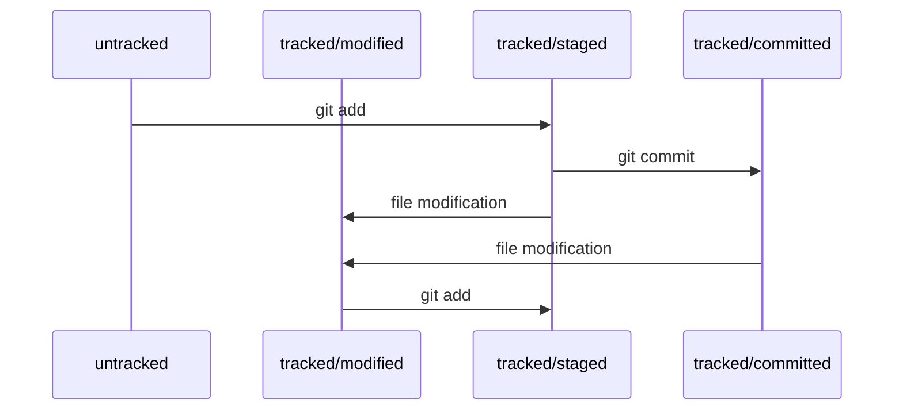

# Git Basics

## The list of Git commands to start with

```bash
git version
```

Shows version of Git installed.


```bash
git config --global user.name 'username'
```

Sets the name that will be added to commits as the name of the author of changes.


```bash
git config --global user.email 'email'
```

Sets the author's email that will be added to commits.


```bash
git config --list
```

Shows the current settings for Git.


```bash
git init
```

Creates a hidden ```.git``` directory in the current (working) directory. 
This hidden directory serves as a ```repository``` and stores the history 
of changes to selected files in the working directory and its subdirectories.


```bash
git status
```

Shows the current status of the repository: if there are any new files or 
changes to monitored files, and if any of these files are prepared to be 
stored in the repository.


```bash
git add [path to file or directory] [path to file or directory] ...
git add --all
```

Prepares files (or all the files in the working directory and its 
subdirectories with ```--all```) to be stored in the repository.


```bash
git commit -m 'message'
```

Saves files, prepared by ```git add```, to the repository and adds 
```message``` as a comment to the commit.


```bash
git log
```

Shows the history of commits in the repository.


```bash
git remote add [name for remote repository] [remote repository URL]
```

Links the repository to a remote repository in order to send and receive 
commits. The remote repository may be accessed by several users simultaneously 
and from different locations.


```bash
git remote -v
```

Shows existing links to remote repositories.


```bash
git push -u [remote repository name] [branch name]
```

Sends changes from the repository to the remote repository. Also links the 
specified branch of the repository to the relevant branch of the remote 
repository, so next time there will be no need to specify the remote 
repository and the branch when sending or receiving changes.


```bash
git push
```

Sends changes from the repository to the remote repository, when the current 
branch is linked to the relevant branch of the remote repository (see 
```git push -u```).


```bash
git clone [remote repository URL]
```

Creates a local copy of remote repository and an appropriate link from the 
newly created repository to the remote repository (see ```git remote -v```). 


## File lifecycle in Git




## Commit messages guidelines

- keep commit summary short (no more than 72 characters), but informative
- prefer verbs to other words: use 'improve' instead of 'improvement'
- write message in the imperative: 'fix' instead of 'fixed'
- separate a detailed commit description from its summary by blank line

Example:

```
fix: rename project to 'Git Basics', improve README formatting

Rename the project to 'Git Basics' as it is to contain different
information on Git, not only Git commands. Introduce the chapter
header for the list of Git commands in README. Add blank lines
in README in order to make it easier to read in raw format.
```


---

Author: Andrei Kuniutka <akuniutka@gmail.com>

Date: February 28, 2024
